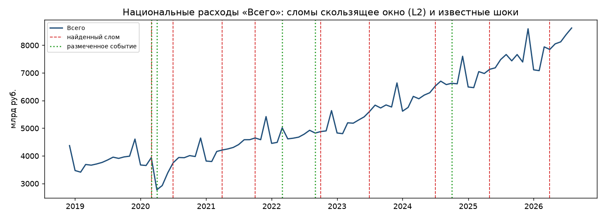
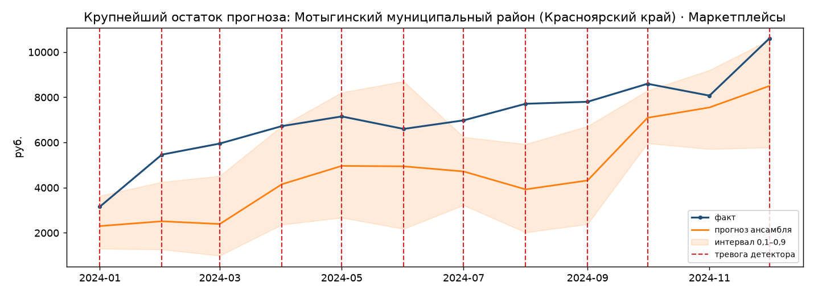

# Разборы реальных примеров

Три разбора собираются командой `uv run sbx cpd cases`; числа и подписи — из
`artifacts/cases/cases.json`, графики — в [figures/](figures/).

## 1. Национальные расходы: что офлайн-метод находит на настоящих шоках

Разбор строится лучшим по F1 офлайн-методом бенчмарка — скользящим окном (L2) — со штрафом,
откалиброванным на полусинтетическом бенчмарке; ряд перед этим переводится в единицы шума (см.
[changepoints.md](changepoints.md)). На ряду «Всего» метод ставит 9 сломов на 93 месяца и
находит **три размеченных события из пяти** в пределах ±2 месяцев:

| Событие | Дата | Найдено | Смещение | Источник |
|---|---|---|---|---|
| Ажиотажный спрос перед нерабочими днями | 2020-03 | да | 0 мес. | [Указ № 206](http://www.kremlin.ru/acts/bank/45335) |
| Нерабочие дни и ограничения COVID-19 | 2020-04 | да | −1 мес. | [Указ № 206](http://www.kremlin.ru/acts/bank/45335) |
| Ключевая ставка 20% | 2022-03 | нет | — | [База ставки ЦБ](https://www.cbr.ru/hd_base/KeyRate/) |
| Частичная мобилизация | 2022-09 | да | +1 мес. | [Указ № 647](http://www.kremlin.ru/acts/bank/48308) |
| Ключевая ставка 21% | 2024-10 | нет | — | [База ставки ЦБ](https://www.cbr.ru/hd_base/KeyRate/) |

**Как это читать.** Первые два события — один и тот же слом марта 2020 года: провал на десятки
процентов, который виден и без метода. Мобилизация «найдена» сломом октября 2022 года, а семь
остальных сломов ни с одним размеченным событием не совпадают: ряд растёт, и метод описывает
тренд ступеньками. Девять сломов с окном ±2 месяца накрывают 47% ряда: с такой вероятностью
рядом со случайной датой оказался бы слом, и три совпадения из пяти сами по себе ничего не
доказывают. Доказательна только весна 2020 года: её метод находит во всех пяти категорийных
рядах. Оба решения по ключевой ставке на месячном ряду «Всего» не видны.

На ряду «Услуги» — тоже три из пяти при 12 сломах, окна которых накрывают 59% ряда: оба события
весны 2020 года и ставка 21% (слом декабря 2024 года, +2 месяца); март и сентябрь 2022 года не
найдены. Услуги — категория, сильнее всего пострадавшая от ограничений 2020 года, и провал там
самый глубокий.

Метод выбран правилом «лучший по F1 на бенчмарке», а на бенчмарке он поднимает тревогу у 95%
рядов без внесённого слома (см. [changepoints.md](changepoints.md)). Разбор поэтому показывает
не то, что метод находит шоки, а то, как мало значит совпадение тревоги с датой события без
сравнения со случайным попаданием. Работает метод задним числом, по всему ряду, и для
сигнализации не подходит.

**Что стояло здесь раньше.** До 2 октября разбор показывал «все пять шоков найдены» при 18
тревогах. Это были тревоги в каждом пятом месяце независимо от данных: при таком шаге и окне
±2 месяца «найденной» окажется любая дата. Причина и исправление — в
[changepoints.md](changepoints.md), раздел «Что было не так с офлайн-методами до 2 октября».

## 2. Что детектор находит на уровне МО

Ряд с наибольшим по модулю стандартизованным остатком прогноза в потоке, который видит живой
детектор: **Мотыгинский муниципальный район Красноярского края, категория «Маркетплейсы»**,
|z| = 18,3 (март 2024). Поток — один прогноз ансамбля на каждый месяц 2024 года, горизонт 1 или
3 месяца.

И это **не шок**. Видно, что расходы на маркетплейсы растут с 3,2 до 10,6 тыс. руб. за год, то
есть более чем втрое, а ансамбль систематически отстаёт: факт выше прогноза во всех двенадцати
месяцах, в семи из них — выше верхней границы интервала 0,1–0,9. Детектор CUSUM по остаткам
ставит тревогу в одиннадцати месяцах из двенадцати, и формально он прав — остатки действительно
аномальны, — но экономически это не смена режима, а устойчивый структурный рост категории, за
которым модель с 24 точками истории не успевает.

Это крайний случай общего свойства потока: на 1 111 рядах оценочной выборки факт выше прогноза
в 70,4% месяцев, и детектор по таким остаткам срабатывает в среднем 2,75 раза на ряд в год
(см. [changepoints.md](changepoints.md), раздел «Эксплуатационный контур»).

В окно попадают три повышения ключевой ставки (июль, сентябрь и октябрь 2024), но приписывать им
этот рост нельзя: рост начался раньше и шёл ровно. Это пример того, как **атрибуция по совпадению
во времени даёт ложное объяснение**, если не смотреть на форму ряда.

Практический вывод: самый большой остаток прогноза — не обязательно самый интересный сигнал.
Для сигнализации нужен детектор, реагирующий на *изменение* режима, а не на *уровень* ошибки;
накопительный детектор по нецентрированным остаткам этому условию не отвечает.

## 3. Чего в данных нет

Два шока, которые напрашивались в разбор, проверены и **не подошли**:

- **Приграничные МО Курской области (август 2024).** В датасете расходов МО этих территорий
  нет вовсе — проверено по таблице территорий.
- **Паводок в Орске (апрель 2024).** Территория в данных есть, но в месячном итоге расходов
  провал не виден: месячная агрегация сглаживает событие, затронувшее часть месяца и часть
  населения.

Именно поэтому основная оценка методов обнаружения построена на полусинтетическом бенчмарке
(см. [changepoints.md](changepoints.md)), а не на реальных региональных шоках. Разборы реальных
примеров ограничены национальным уровнем, где эффект бесспорен.
