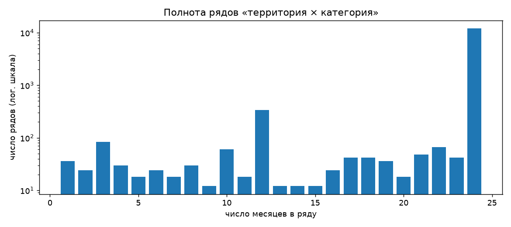
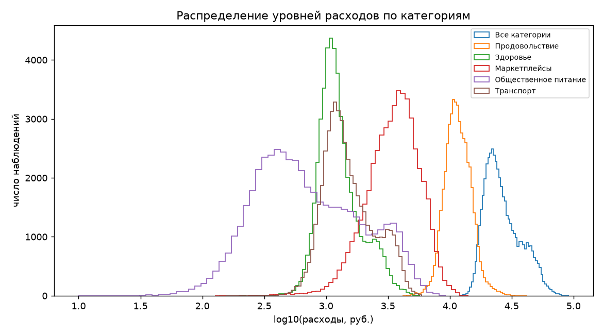
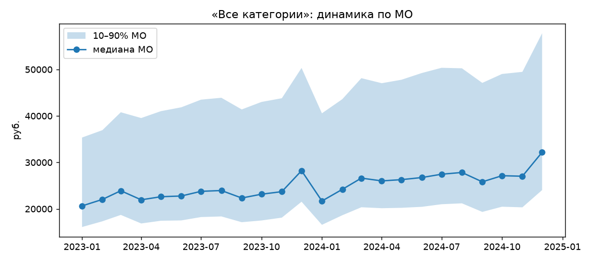
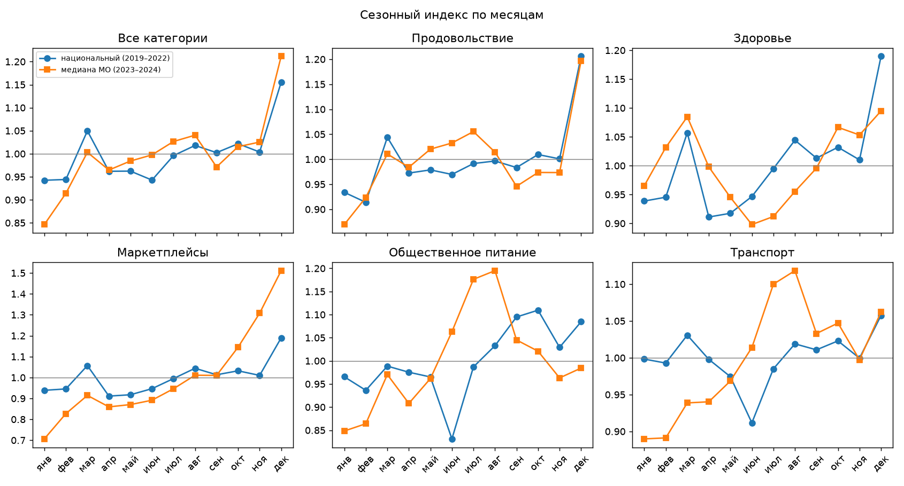

# Разведочный анализ панели расходов МО

Воспроизводится командой `make panel` (`sbx data panel`); числа — из `data/processed/panel_summary.json`.

## Панель

Панель строится из набора организаторов конкурса по официальным кодам территорий.

| Показатель | Значение |
|---|---|
| Наблюдений (территория × категория × месяц) | 303 126 |
| Рядов `unique_id = territory_id__category` | 13 140 |
| Территорий | 2 190, у каждой все шесть категорий |
| Полных рядов (24 месяца) | 12 096 |
| Неполных рядов | 1 044, из них 468 с пропусками внутри ряда |

Неполные ряды не удаляются: в `panel.parquet` у каждого наблюдения есть флаги `n_obs`, `first_ds`, `last_ds`, `is_complete`, `has_gaps`. Административных разрывов в панели нет: официальный код — это МО в постоянных границах, и преемник при реорганизации получает собственный код и собственный ряд.

Статические признаки ряда — в `static.parquet`: регион, федеральный округ, код ОКТМО, тип МО, категория и размер территории. Размер — `size_level`, логарифм медианы «Все категории», и `size_group`, её квинтиль. Он оценивается по месяцам не позже самого раннего момента прогноза (январь–октябрь 2023 года): признак один на все окна проверки и не должен знать о месяцах, которые в ранних окнах ещё не наступили. У 30 территорий ряд «Все категории» начинается позже; размера у них нет (180 рядов). Численность населения МО из бюллетеня Росстата подключена отдельным блоком признаков, а не вместо размера.

## Уровни и единица измерения

Медианы по категориям, руб. в месяц: «Все категории» 25 029, «Продовольствие» 11 492, «Маркетплейсы» 3 634, «Транспорт» 1 386, «Здоровье» 1 188, «Общественное питание» 617. Порядок величин соответствует месячным расходам **в расчёте на одного клиента/жителя**, а не суммарному обороту территории.

## Аддитивность категорий

По 50 521 паре (территория, месяц) с полным набором категорий сумма пяти категорий составляет в медиане **71,8%** от «Все категории» (5–95%: 62,5–80,5%). Сумма ни разу не превышает итог, каждая категория всегда не больше итога.

**Вывод:** «Все категории» включает неописанный остаток (одежда, электроника, услуги и т. п.), а сами значения — средние на клиента. Поэтому:
- иерархическое согласование «категории → итог» (MinT и аналоги) неприменимо — итог не равен сумме наблюдаемых частей;
- согласование «МО → регион → страна» суммированием тоже неприменимо — средние на клиента не складываются без весов (численности клиентов нет в данных).

Иерархическое согласование в решение не входит; категории прогнозируются как отдельные ряды одной глобальной моделью.

## Сезонность

Национальный индекс построен по `consumer-spending` (млрд руб.) методом отношения к центрированному 2×12 скользящему среднему, медиана по годам. Соответствие категорий: «Всего» → «Все категории», «Продовольственные товары» → «Продовольствие», «Общественное питание» → «Общественное питание», «Непродовольственные товары» → «Здоровье» и «Маркетплейсы», «Услуги» → «Транспорт» (приближённо). Панельный индекс — медиана по рядам МО отношения к среднему за год (2023–2024).

**По каким месяцам оценён индекс.** Таблица `seasonal_index.parquet` и этот график — по месяцам национального ряда, опубликованным к началу панели: январь 2019 — ноябрь 2022. Её читают детекторы сдвигов на всём периоде панели, поэтому в ней не должно быть ни одного более позднего месяца. В бэктесте прогнозов индекс оценивается для каждого окна заново — по месяцам, опубликованным к моменту прогноза.

- Декабрьский пик и январский провал есть во всех категориях. Размах max/min: национальный 1,16–1,34, панельный 1,22–2,14.
- Корреляция национального и панельного индексов — 0,58. У «Общественного питания» и «Транспорта» в МО выраженный летний пик (июль–август), которого нет в национальных данных: это отпускная и региональная сезонность.
- Цена короткого окна оценки: отношению к скользящему среднему нужно полгода данных с каждой стороны, поэтому за 2019–2022 годы на каждый календарный месяц приходится два-три значения, и медиана шок 2020 года не отсекает. Национальный индекс «Общественного питания» за июнь — 0,83 при 0,96–0,99 в соседних месяцах: в оценку вошли только июнь 2020 и июнь 2021 года. Сезонно-наивный прогноз, по остаткам которого сравниваются детекторы, наследует это искажение.
- Панельный профиль «Маркетплейсов» (размах 2,14) содержит рост категории внутри года, а не только сезонность. На двух годах истории их не разделить, поэтому в модели национальный индекс даётся как отдельный признак, а не вычитается.
